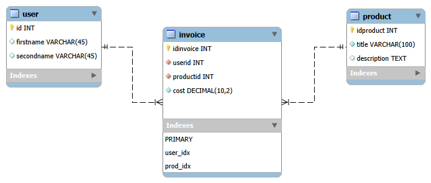
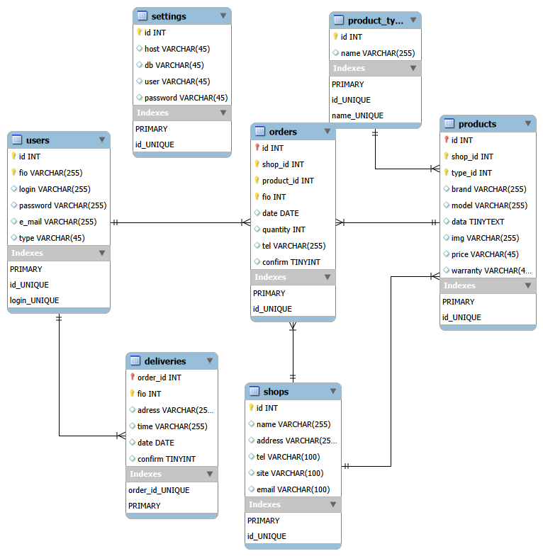

# Лабораторная работа №2
# Задание 1
## 1. Схема в виде изображения



## 2. SQL-скрипт создания базы данных

```sql
-- MySQL Script generated by MySQL Workbench
-- Mon Sep 21 22:34:52 2026
-- Model: New Model    Version: 1.0
-- MySQL Workbench Forward Engineering

SET @OLD_UNIQUE_CHECKS=@@UNIQUE_CHECKS, UNIQUE_CHECKS=0;
SET @OLD_FOREIGN_KEY_CHECKS=@@FOREIGN_KEY_CHECKS, FOREIGN_KEY_CHECKS=0;
SET @OLD_SQL_MODE=@@SQL_MODE, SQL_MODE='ONLY_FULL_GROUP_BY,STRICT_TRANS_TABLES,NO_ZERO_IN_DATE,NO_ZERO_DATE,ERROR_FOR_DIVISION_BY_ZERO,NO_ENGINE_SUBSTITUTION';

-- -----------------------------------------------------
-- Schema firstModel
-- -----------------------------------------------------
CREATE SCHEMA IF NOT EXISTS `firstModel` DEFAULT CHARACTER SET utf8 ;
USE `firstModel` ;

-- -----------------------------------------------------
-- Table `firstModel`.`user`
-- -----------------------------------------------------
CREATE TABLE IF NOT EXISTS `firstModel`.`user` (
  `id` INT NOT NULL AUTO_INCREMENT,
  `firstname` VARCHAR(45) NULL,
  `secondname` VARCHAR(45) NULL,
  PRIMARY KEY (`id`))
ENGINE = InnoDB;

-- -----------------------------------------------------
-- Table `firstModel`.`product`
-- -----------------------------------------------------
CREATE TABLE IF NOT EXISTS `firstModel`.`product` (
  `idproduct` INT NOT NULL AUTO_INCREMENT,
  `title` VARCHAR(100) NOT NULL,
  `description` TEXT NULL,
  PRIMARY KEY (`idproduct`))
ENGINE = InnoDB;

-- -----------------------------------------------------
-- Table `firstModel`.`invoice`
-- -----------------------------------------------------
CREATE TABLE IF NOT EXISTS `firstModel`.`invoice` (
  `idinvoice` INT NOT NULL AUTO_INCREMENT,
  `userid` INT NOT NULL,
  `productid` INT NOT NULL,
  `cost` DECIMAL(10,2) NOT NULL,
  PRIMARY KEY (`idinvoice`),
  INDEX `user_idx` (`userid` ASC) VISIBLE,
  INDEX `prod_idx` (`productid` ASC) VISIBLE,
  CONSTRAINT `user`
    FOREIGN KEY (`userid`)
    REFERENCES `firstModel`.`user` (`id`)
    ON DELETE CASCADE
    ON UPDATE CASCADE,
  CONSTRAINT `prod`
    FOREIGN KEY (`productid`)
    REFERENCES `firstModel`.`product` (`idproduct`)
    ON DELETE CASCADE
    ON UPDATE CASCADE)
ENGINE = InnoDB;

SET SQL_MODE=@OLD_SQL_MODE;
SET FOREIGN_KEY_CHECKS=@OLD_FOREIGN_KEY_CHECKS;
SET UNIQUE_CHECKS=@OLD_UNIQUE_CHECKS;
```

---

## 3. Фрагмент запроса: создание и настройка таблицы `invoice`

```sql
-- -----------------------------------------------------
-- Table `firstModel`.`invoice`
-- -----------------------------------------------------
CREATE TABLE IF NOT EXISTS `firstModel`.`invoice` (
  `idinvoice` INT NOT NULL AUTO_INCREMENT,
  `userid` INT NOT NULL,
  `productid` INT NOT NULL,
  `cost` DECIMAL(10,2) NOT NULL,
  PRIMARY KEY (`idinvoice`),
  INDEX `user_idx` (`userid` ASC) VISIBLE,
  INDEX `prod_idx` (`productid` ASC) VISIBLE,
  CONSTRAINT `user`
    FOREIGN KEY (`userid`)
    REFERENCES `firstModel`.`user` (`id`)
    ON DELETE CASCADE
    ON UPDATE CASCADE,
  CONSTRAINT `prod`
    FOREIGN KEY (`productid`)
    REFERENCES `firstModel`.`product` (`idproduct`)
    ON DELETE CASCADE
    ON UPDATE CASCADE)
ENGINE = InnoDB;
```

---

# Задание 2

## 1. Схема в виде изображения



---

## 2. SQL-скрипт создания базы данных

```sql
-- MySQL Script generated by MySQL Workbench
-- Mon Sep 21 23:09:38 2026
-- Model: New Model    Version: 1.0
-- MySQL Workbench Forward Engineering

SET @OLD_UNIQUE_CHECKS=@@UNIQUE_CHECKS, UNIQUE_CHECKS=0;
SET @OLD_FOREIGN_KEY_CHECKS=@@FOREIGN_KEY_CHECKS, FOREIGN_KEY_CHECKS=0;
SET @OLD_SQL_MODE=@@SQL_MODE, SQL_MODE='ONLY_FULL_GROUP_BY,STRICT_TRANS_TABLES,NO_ZERO_IN_DATE,NO_ZERO_DATE,ERROR_FOR_DIVISION_BY_ZERO,NO_ENGINE_SUBSTITUTION';

-- -----------------------------------------------------
-- Schema mydb
-- -----------------------------------------------------
CREATE SCHEMA IF NOT EXISTS `mydb` DEFAULT CHARACTER SET utf8 ;
USE `mydb` ;

-- -----------------------------------------------------
-- Table `mydb`.`users`
-- -----------------------------------------------------
CREATE TABLE IF NOT EXISTS `mydb`.`users` (
  `id` INT NOT NULL AUTO_INCREMENT,
  `fio` VARCHAR(255) NOT NULL,
  `login` VARCHAR(255) NULL,
  `password` VARCHAR(255) NULL,
  `e_mail` VARCHAR(255) NULL,
  `type` VARCHAR(45) NULL,
  PRIMARY KEY (`id`, `fio`),
  UNIQUE INDEX `id_UNIQUE` (`id` ASC) VISIBLE,
  UNIQUE INDEX `login_UNIQUE` (`login` ASC) VISIBLE)
ENGINE = InnoDB;

-- -----------------------------------------------------
-- Table `mydb`.`user`
-- -----------------------------------------------------
CREATE TABLE IF NOT EXISTS `mydb`.`user` (
  `username` VARCHAR(16) NOT NULL,
  `email` VARCHAR(255) NULL,
  `password` VARCHAR(32) NOT NULL,
  `create_time` TIMESTAMP NULL DEFAULT CURRENT_TIMESTAMP);

-- -----------------------------------------------------
-- Table `mydb`.`settings`
-- -----------------------------------------------------
CREATE TABLE IF NOT EXISTS `mydb`.`settings` (
  `id` INT NOT NULL AUTO_INCREMENT,
  `host` VARCHAR(45) NULL,
  `db` VARCHAR(45) NULL,
  `user` VARCHAR(45) NULL,
  `password` VARCHAR(45) NULL,
  PRIMARY KEY (`id`),
  UNIQUE INDEX `id_UNIQUE` (`id` ASC) VISIBLE)
ENGINE = InnoDB;

-- -----------------------------------------------------
-- Table `mydb`.`shops`
-- -----------------------------------------------------
CREATE TABLE IF NOT EXISTS `mydb`.`shops` (
  `id` INT NOT NULL AUTO_INCREMENT,
  `name` VARCHAR(255) NULL,
  `address` VARCHAR(255) NULL,
  `tel` VARCHAR(100) NULL,
  `site` VARCHAR(100) NULL,
  `email` VARCHAR(100) NULL,
  PRIMARY KEY (`id`),
  UNIQUE INDEX `id_UNIQUE` (`id` ASC) VISIBLE)
ENGINE = InnoDB;

-- -----------------------------------------------------
-- Table `mydb`.`product_type`
-- -----------------------------------------------------
CREATE TABLE IF NOT EXISTS `mydb`.`product_type` (
  `id` INT NOT NULL AUTO_INCREMENT,
  `name` VARCHAR(255) NULL,
  PRIMARY KEY (`id`),
  UNIQUE INDEX `id_UNIQUE` (`id` ASC) VISIBLE,
  UNIQUE INDEX `name_UNIQUE` (`name` ASC) VISIBLE)
ENGINE = InnoDB;

-- -----------------------------------------------------
-- Table `mydb`.`products`
-- -----------------------------------------------------
CREATE TABLE IF NOT EXISTS `mydb`.`products` (
  `id` INT NOT NULL AUTO_INCREMENT,
  `shop_id` INT NOT NULL,
  `type_id` INT NOT NULL,
  `brand` VARCHAR(255) NULL,
  `model` VARCHAR(255) NULL,
  `data` TINYTEXT NULL,
  `img` VARCHAR(255) NULL,
  `price` VARCHAR(45) NULL,
  `warranty` VARCHAR(45) NULL,
  PRIMARY KEY (`id`, `shop_id`, `type_id`),
  UNIQUE INDEX `id_UNIQUE` (`id` ASC) VISIBLE,
  CONSTRAINT `shopid`
    FOREIGN KEY (`id`)
    REFERENCES `mydb`.`shops` (`id`)
    ON DELETE CASCADE
    ON UPDATE CASCADE,
  CONSTRAINT `typeid`
    FOREIGN KEY (`id`)
    REFERENCES `mydb`.`product_type` (`id`)
    ON DELETE CASCADE
    ON UPDATE CASCADE)
ENGINE = InnoDB;

-- -----------------------------------------------------
-- Table `mydb`.`orders`
-- -----------------------------------------------------
CREATE TABLE IF NOT EXISTS `mydb`.`orders` (
  `id` INT NOT NULL AUTO_INCREMENT,
  `shop_id` INT NOT NULL,
  `product_id` INT NOT NULL,
  `fio` INT NOT NULL,
  `date` DATE NULL,
  `quantity` INT NULL,
  `tel` VARCHAR(255) NULL,
  `confirm` TINYINT NULL,
  PRIMARY KEY (`id`, `shop_id`, `product_id`, `fio`),
  UNIQUE INDEX `id_UNIQUE` (`id` ASC) VISIBLE,
  CONSTRAINT `shopid`
    FOREIGN KEY (`id`)
    REFERENCES `mydb`.`shops` (`id`)
    ON DELETE CASCADE
    ON UPDATE CASCADE,
  CONSTRAINT `productid`
    FOREIGN KEY (`id`)
    REFERENCES `mydb`.`products` (`id`)
    ON DELETE CASCADE
    ON UPDATE CASCADE,
  CONSTRAINT `fio`
    FOREIGN KEY (`id`)
    REFERENCES `mydb`.`users` (`id`)
    ON DELETE CASCADE
    ON UPDATE CASCADE)
ENGINE = InnoDB;

-- -----------------------------------------------------
-- Table `mydb`.`deliveries`
-- -----------------------------------------------------
CREATE TABLE IF NOT EXISTS `mydb`.`deliveries` (
  `order_id` INT NOT NULL AUTO_INCREMENT,
  `fio` INT NOT NULL,
  `adress` VARCHAR(255) NULL,
  `time` VARCHAR(255) NULL,
  `date` DATE NULL,
  `confirm` TINYINT NULL,
  UNIQUE INDEX `order_id_UNIQUE` (`order_id` ASC) VISIBLE,
  PRIMARY KEY (`order_id`, `fio`),
  CONSTRAINT `orderid`
    FOREIGN KEY (`order_id`)
    REFERENCES `mydb`.`orders` (`id`)
    ON DELETE NO ACTION
    ON UPDATE NO ACTION,
  CONSTRAINT `fio`
    FOREIGN KEY (`order_id`)
    REFERENCES `mydb`.`users` (`id`)
    ON DELETE CASCADE
    ON UPDATE CASCADE)
ENGINE = InnoDB;

USE `mydb` ;

-- -----------------------------------------------------
-- Placeholder table for view `mydb`.`view1`
-- -----------------------------------------------------
CREATE TABLE IF NOT EXISTS `mydb`.`view1` (`id` INT);

-- -----------------------------------------------------
-- View `mydb`.`view1`
-- -----------------------------------------------------
DROP TABLE IF EXISTS `mydb`.`view1`;
USE `mydb`;

SET SQL_MODE=@OLD_SQL_MODE;
SET FOREIGN_KEY_CHECKS=@OLD_FOREIGN_KEY_CHECKS;
SET UNIQUE_CHECKS=@OLD_UNIQUE_CHECKS;
```

---

## 3. Фрагмент запроса: создание и настройка таблицы `orders`

```sql
-- -----------------------------------------------------
-- Table `mydb`.`orders`
-- -----------------------------------------------------
CREATE TABLE IF NOT EXISTS `mydb`.`orders` (
  `id` INT NOT NULL AUTO_INCREMENT,
  `shop_id` INT NOT NULL,
  `product_id` INT NOT NULL,
  `fio` INT NOT NULL,
  `date` DATE NULL,
  `quantity` INT NULL,
  `tel` VARCHAR(255) NULL,
  `confirm` TINYINT NULL,
  PRIMARY KEY (`id`, `shop_id`, `product_id`, `fio`),
  UNIQUE INDEX `id_UNIQUE` (`id` ASC) VISIBLE,
  CONSTRAINT `shopid`
    FOREIGN KEY (`id`)
    REFERENCES `mydb`.`shops` (`id`)
    ON DELETE CASCADE
    ON UPDATE CASCADE,
  CONSTRAINT `productid`
    FOREIGN KEY (`id`)
    REFERENCES `mydb`.`products` (`id`)
    ON DELETE CASCADE
    ON UPDATE CASCADE,
  CONSTRAINT `fio`
    FOREIGN KEY (`id`)
    REFERENCES `mydb`.`users` (`id`)
    ON DELETE CASCADE
    ON UPDATE CASCADE)
ENGINE = InnoDB;
```
